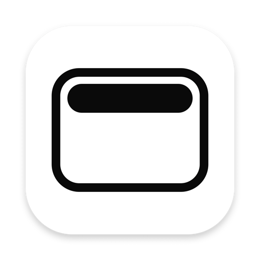
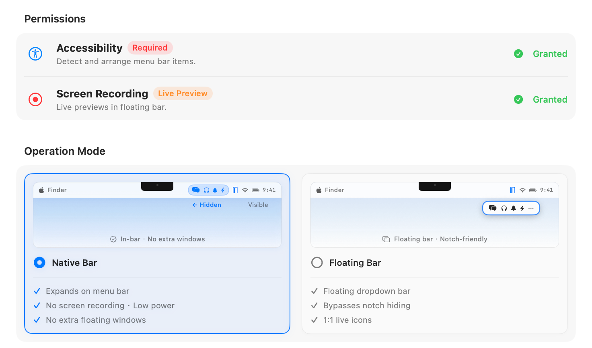

<p align="center">
  
</p>

<h1 align="center">xBar</h1>

<p align="center">
  <b>A lightweight, elegant, and modular menu bar manager for macOS.</b>
</p>

<p align="center">
  
  
  
  <a href="https://github.com/XERA-2011/sponsor"></a>
</p>

---

## Overview

**xBar** keeps your macOS menu bar clean and organized. Hide inactive status items and expand them on demand through native in-bar expansion or a notch-friendly floating panel.

---

## ⚡ Operation Modes

xBar provides two distinct operation modes tailored to your workflow:

<p align="center">
  
</p>

- **Native Bar**: Expands hidden icons directly inside the macOS menu bar. Clean single-layer experience with ultra-low power consumption and zero extra windows.
- **Floating Bar**: Displays hidden items in an interactive floating panel anchored directly below the menu bar item. Bypasses MacBook notch clipping and renders 1:1 live items.

---

## 🖥 System Requirements

- **Operating System**: macOS 14.0 (Sonoma) or later.
- **Permissions**:
  - **Accessibility** *(Required)*: Enables menu bar item arrangement and click routing.
  - **Screen Recording** *(Optional)*: Required only for live icon capture in Floating Bar mode.

---

## 📦 Installation

Download the latest release package (`xBar.dmg`) from [GitHub Releases](https://github.com/XERA-2011/x-bar/releases). Open the DMG and drag **xBar** into your `Applications` folder.

---

## 🛠 Building from Source

```bash
# Clone the repository
git clone https://github.com/XERA-2011/x-bar.git
cd x-bar

# Build the release application bundle (outputs to dist/xBar.app)
./scripts/build-app.sh release

# Or package into DMG, ZIP and checksums (outputs to dist/)
./scripts/package.sh
```

The output bundle will be located at `dist/xBar.app` (or `dist/xBar.dmg`). Move it to `/Applications` to run.

---

## 🙏 Acknowledgements

xBar builds upon the ideas and pioneering work of the open-source community:

- **[jordanbaird/Ice](https://github.com/jordanbaird/Ice)** — The powerful menu bar manager for macOS.
- **[thaw-app/Thaw](https://github.com/thaw-app/Thaw)** — Modern macOS menu bar enhancement suite.

## ❤️ Support & Sponsor

If you find xBar helpful, consider [sponsoring the project](https://github.com/XERA-2011/sponsor). Your support helps keep the project maintained!

---

## 📄 License

This project is licensed under the [GNU General Public License v3.0](LICENSE).
